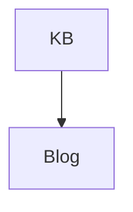

# Published Note

This published note links to [[second-note|another note]], [[youtube-source|the original source]],
[[private-source]], and [[missing-note]].

It also links with markdown syntax to [second](./second-note.md), [source](../sources/youtube-source.md),
and [private](../sources/private-source.md).

> [!TIP]
> Alerts should survive markdown rendering.

| Feature | Expected  |
| ------- | --------- |
| Table   | Supported |

- [x] GFM task
- [ ] Pending task

Inline math $a^2 + b^2 = c^2$ and block math:

$$
E = mc^2
$$

$$
\text{MSE}(q) = \mathbb{E}_X\big[d(q(x), x)^2\big]
$$



```typescript
export const answer = 42;
```


## Details Section

The table of contents should include this heading.
